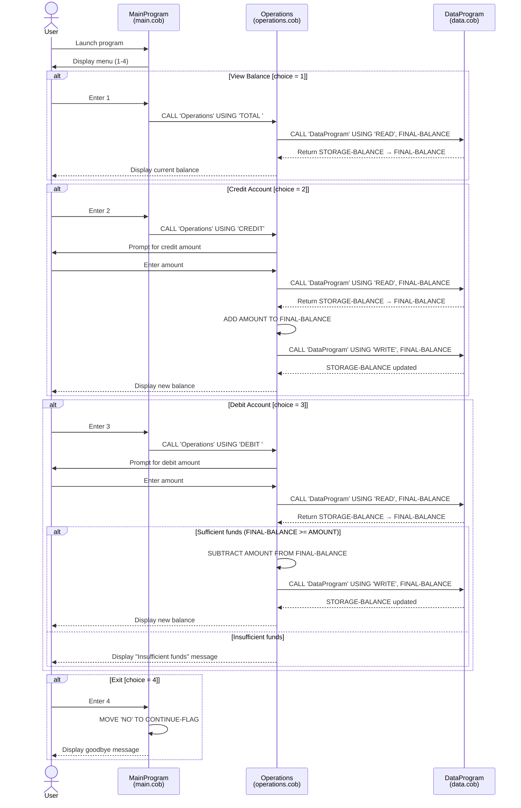

# Student Account Management System — COBOL Documentation

## Overview

This system is a COBOL-based student account management application. It provides a menu-driven interface for viewing balances, crediting funds to an account, and debiting funds from an account. The system is organized across three COBOL source files with a clear separation of concerns: presentation, business logic, and data access.

---

## File Descriptions

### `src/cobol/main.cob` — Entry Point / Menu Controller

**Program ID:** `MainProgram`

This is the top-level program and the application entry point. It is responsible for:

- Displaying the interactive menu to the user.
- Accepting user input and routing to the appropriate operation.
- Controlling the application loop via the `CONTINUE-FLAG` field.

**Key Variables**

| Variable | Type | Description |
|---|---|---|
| `USER-CHOICE` | `PIC 9` | Stores the numeric menu selection (1–4). |
| `CONTINUE-FLAG` | `PIC X(3)` | Loop control flag; set to `'NO'` to exit. |

**Control Flow**

| Menu Choice | Action |
|---|---|
| `1` | Calls `Operations` with `'TOTAL '` — displays current balance. |
| `2` | Calls `Operations` with `'CREDIT'` — credits an amount. |
| `3` | Calls `Operations` with `'DEBIT '` — debits an amount. |
| `4` | Sets `CONTINUE-FLAG` to `'NO'`, exiting the loop. |
| Other | Displays an invalid choice message. |

---

### `src/cobol/operations.cob` — Business Logic Layer

**Program ID:** `Operations`

This program handles all account transaction logic. It is called by `MainProgram` with an operation type and dispatches calls to `DataProgram` to read or write the account balance.

**Key Variables**

| Variable | Type | Description |
|---|---|---|
| `OPERATION-TYPE` | `PIC X(6)` | Local copy of the operation passed in from the caller. |
| `AMOUNT` | `PIC 9(6)V99` | The transaction amount entered by the user. |
| `FINAL-BALANCE` | `PIC 9(6)V99` | The current account balance, used for calculations. |
| `PASSED-OPERATION` | `PIC X(6)` (Linkage) | The operation code received from `MainProgram`. |

**Key Functions / Paragraphs**

| Operation Code | Behavior |
|---|---|
| `'TOTAL '` | Reads the current balance from `DataProgram` and displays it. |
| `'CREDIT'` | Prompts for an amount, reads the current balance, adds the amount, and writes the updated balance back via `DataProgram`. |
| `'DEBIT '` | Prompts for an amount, reads the current balance, and subtracts the amount if funds are sufficient; otherwise displays an insufficient funds message. |

**Business Rules**

- **Insufficient funds protection:** A debit is only processed if `FINAL-BALANCE >= AMOUNT`. If the debit amount exceeds the available balance, the transaction is rejected and no change is written.
- **No overdraft:** Student accounts cannot go below zero. The system enforces a hard floor of `0.00` through the insufficient funds check.
- **Initial balance:** The account balance is initialized to `1000.00` in both `operations.cob` and `data.cob`. This represents the starting balance for a student account.

---

### `src/cobol/data.cob` — Data Access Layer

**Program ID:** `DataProgram`

This program acts as the data persistence layer. It manages a single in-memory balance value (`STORAGE-BALANCE`) and supports two operations: reading the current balance and writing an updated balance.

**Key Variables**

| Variable | Type | Description |
|---|---|---|
| `STORAGE-BALANCE` | `PIC 9(6)V99` | In-memory store for the account balance. Initialized to `1000.00`. |
| `OPERATION-TYPE` | `PIC X(6)` | Local copy of the operation code received. |
| `PASSED-OPERATION` | `PIC X(6)` (Linkage) | The operation code (`'READ'` or `'WRITE'`) passed by the caller. |
| `BALANCE` | `PIC 9(6)V99` (Linkage) | Shared balance field for data exchange with the caller. |

**Key Functions / Paragraphs**

| Operation Code | Behavior |
|---|---|
| `'READ'` | Copies `STORAGE-BALANCE` into the linkage `BALANCE` field so the caller can retrieve the current value. |
| `'WRITE'` | Copies the linkage `BALANCE` field into `STORAGE-BALANCE`, persisting the updated value for the session. |

**Business Rules**

- **Session-scoped persistence:** Balance changes are stored only in working storage (`STORAGE-BALANCE`). Data is not written to a file or database and is lost when the program terminates.
- **Initial balance:** The starting balance is hardcoded to `1000.00`, representing the default starting credit for a student account.

---

## Program Call Hierarchy

```
MainProgram (main.cob)
└── Operations (operations.cob)
    └── DataProgram (data.cob)
```

---

## Business Rules Summary

| Rule | Details |
|---|---|
| Starting balance | All student accounts begin with a balance of `1000.00`. |
| No overdraft | Debit transactions that exceed the current balance are rejected. |
| Session persistence only | Balance changes are held in memory and not persisted across program runs. |
| Valid operations | Only `TOTAL`, `CREDIT`, and `DEBIT` operations are supported; all other inputs are ignored or rejected. |

---

## Application Data Flow


